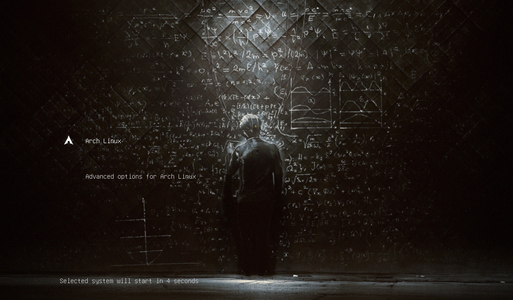

# MathTheme

Math theme for GRUB bootloader.

## Dependencies

Only GNU GRUB bootloader is required.

## Installation

### Automatic installation

#### Install

For installation use the script **install.sh**.
This script requires superuser privileges (sudo).

❗ Tested for ArchLinux only.

```shell
sudo ./install.sh
```

#### Uninstall

For uninstallation use the script **uninstall.sh**.
This script also requires superuser privileges.

```shell
sudo ./uninstall.sh
```

### Half Manually

There is a **make_package.sh** script for creating a package for manual installation.

```shell
./make_package.sh
```

As a result, we get an archive (**MathTheme.tar.gz**) that can be imported, for example, using [Grub Customizer](https://launchpad.net/grub-customizer).

## Screenshot



The background artist is [Kuldar Leement](https://kuldarleement.eu/).

## Copyright

Copyright?
